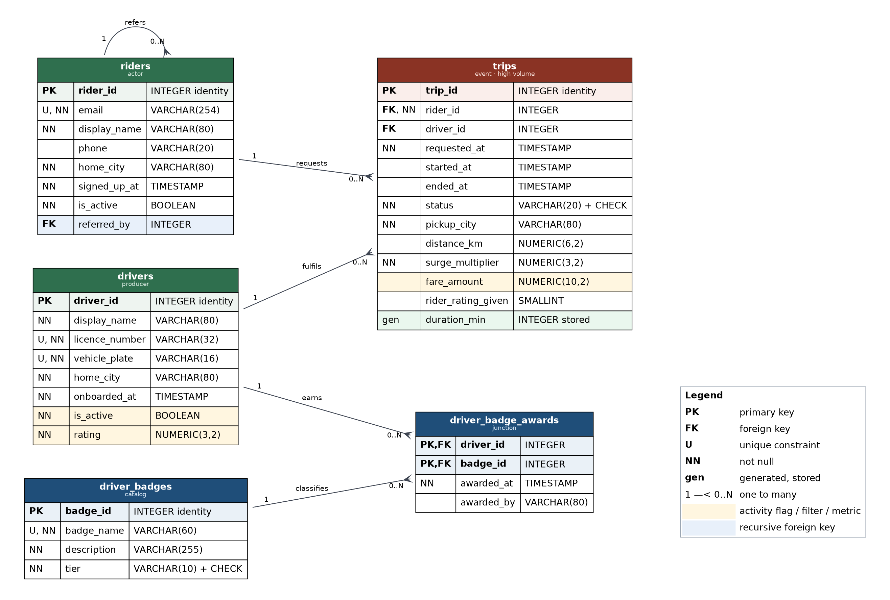

# Ride Sharing Platform — Relational Database Design

A PostgreSQL database modelling the trips, riders, drivers and driver-reward programme of a
city-scale ride sharing platform.

**Author:** *&lt;your name&gt;*
**Course:** EX 603 — Course Project, Units 1–6
**Theme:** 1 — Ride Sharing
**Status:** Unit 2 complete (schema built and running). Unit 3 will add queries.

---

## The domain

The system models a ride sharing marketplace: an application that matches people who want to
travel with drivers willing to carry them, prices each journey, and records the result. Two
populations meet on the platform. **Riders** open the app and request a trip. **Drivers** are
the supply side — vetted, licensed, each associated with one vehicle, each carrying a rolling
quality rating and a flag indicating whether they are currently permitted to accept work.
Every request either becomes a completed journey or is cancelled, and either way it is
recorded as a row in the **trips** table, which is the high-volume heart of the system. A
mature platform in a single large city generates hundreds of thousands of these rows a month,
which is why almost every design decision in this repository is made with that table's read
and write patterns in mind.

Alongside the marketplace runs a driver rewards programme. **Driver badges** form a small
catalogue of achievements — "Night Owl", "500 Trips", "Five-Star Streak" — and drivers earn
them over time. A driver may hold many badges and a badge may be held by many drivers, so the
relationship is many-to-many and is resolved through the **driver badge awards** junction,
whose composite primary key makes it impossible to award the same badge twice.

The design exists to answer questions the business actually asks. On the operations side:
which trips are in progress right now, and which requests are still waiting for a driver? On
the finance side: what did the platform earn last month, by city and by day, and how much of
that is attributable to surge pricing? On the supply side: which drivers are active, how do
their ratings distribute, and does holding a particular badge correlate with higher earnings
per trip? On the demand side: when are the peak hours, how does weekday demand differ from
weekend, and what proportion of requests are abandoned before a driver is matched? Units 3
to 6 build the query catalogue that answers these; Unit 1 makes sure the data can support
them and that no answer can be corrupted by a row that should never have been stored.

---

## Schema



Five relations, following the course's five-role structure:

| Role | Relation | What it holds |
| --- | --- | --- |
| actor | `riders` | One row per rider account. |
| producer | `drivers` | One row per approved driver. Carries the activity flag (`is_active`) and the numeric filter attribute (`rating`). |
| event | `trips` | One row per requested ride. Carries the metric (`fare_amount`) and the timestamps. |
| catalog | `driver_badges` | The achievement catalogue. |
| junction | `driver_badge_awards` | Composite-keyed M:N link between drivers and badges. |

### Key design decisions

- **Surrogate primary keys everywhere except the junction**, which is keyed on
  `(driver_id, badge_id)` because that composite is itself the rule preventing duplicate
  awards.
- **`RESTRICT` on the trip foreign keys, `CASCADE` on the award foreign keys.** Trips are
  financial records that must outlive an account; awards are meaningless without their parent.
  The same parent table takes different actions in different children, because the children
  differ in what they are worth.
- **`SET NULL` on the recursive referral key.** `CASCADE` there would delete a referrer's
  entire downstream referral tree; `RESTRICT` would make popular referrers undeletable.
- **Money and ratings as `NUMERIC`, never floating point**, because both are summed and
  compared against exact thresholds.
- **Status cannot lie about its own row.** Three constraints tie the fare, the end time and
  the driver to `status` *individually*. A single equivalence over all three looks equivalent
  and is not — it lets an uncompleted trip carry a charge. Testing caught it; the story is in
  [`/analysis/unit2.md`](analysis/unit2.md).
- **`duration_min` is generated and stored**, because it is a pure function of two columns in
  its own row and so cannot drift. `drivers.rating` depends on another table and is
  deliberately left to the application.

Full detail: [`/schema/schema-definition.md`](schema/schema-definition.md) and
[`/schema/constraints.md`](schema/constraints.md).

### Running the schema

```bash
createdb ex603_ridesharing
psql -d ex603_ridesharing -f schema/schema.sql
```

The script is idempotent — it drops in reverse creation order before it creates, so it can be
run repeatedly with no manual cleanup. Creation order is `riders` → `drivers` →
`driver_badges` → `trips` → `driver_badge_awards`.

---

## Repository structure

| Path | Contents |
| --- | --- |
| [`/schema/schema.sql`](schema/schema.sql) | Task 2.1 — the complete DDL, commented, runs top to bottom. |
| [`/schema/schema-definition.md`](schema/schema-definition.md) | Task 1.1 — all five relation schemas, attribute domains, primary and candidate keys. |
| [`/schema/erd.png`](schema/erd.png) | Task 1.2 — the exported ERD, updated in Unit 2. |
| [`/schema/erd.dot`](schema/erd.dot) | Editable Graphviz source for the ERD. |
| [`/schema/constraints.md`](schema/constraints.md) | Task 1.3 — every constraint with its justification, including each `ON DELETE` choice. |
| [`/analysis/unit1.md`](analysis/unit1.md) | Task 1.4 — modelling justification and reflection. |
| [`/analysis/unit2.md`](analysis/unit2.md) | Task 2.2 — creation order, constraints table, and the CHECK narrative. |
| `/screenshots` | Execution evidence. |
| `/queries/unit3` … `unit6` | Empty until Unit 3. |

---

## Regenerating the ERD

The diagram is generated from source rather than drawn by hand, so it can be revised in later
units without redrawing:

```bash
dot -Tpng -Gdpi=140 schema/erd.dot -o schema/erd.png
```

Requires [Graphviz](https://graphviz.org/download/).

---

## Roadmap

| Unit | Deliverable |
| --- | --- |
| 1 | Relational design, ERD, integrity constraints. ✅ |
| **2** | DDL implementation. ✅ |
| 3 | Single-table queries. |
| 4 | Joins across the five relations. |
| 5 | Aggregation and analysis. |
| 6 | Written analysis and recorded video presentation. |

---

## Notes

No credentials, connection strings, or personal data appear anywhere in this repository,
including in screenshots and SQL file headers.
